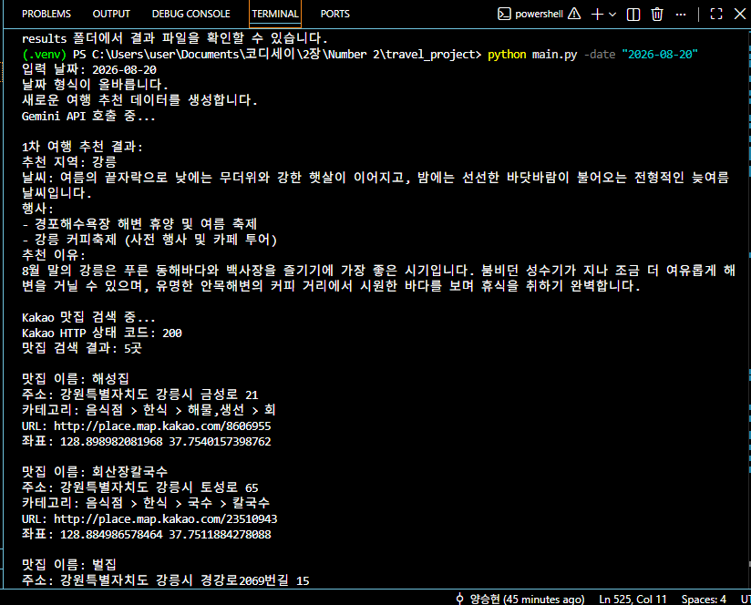
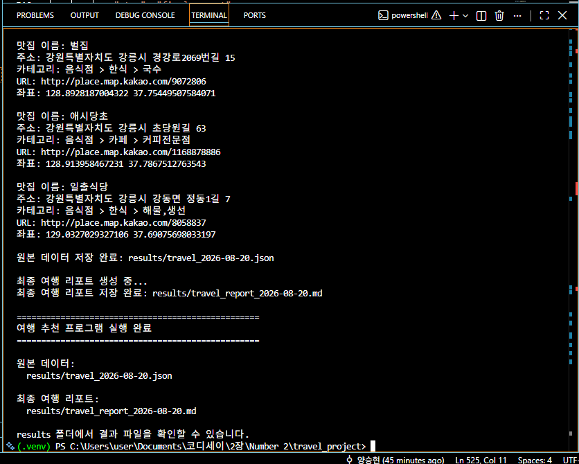
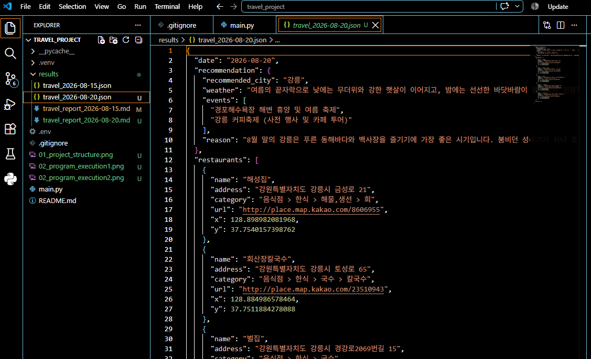
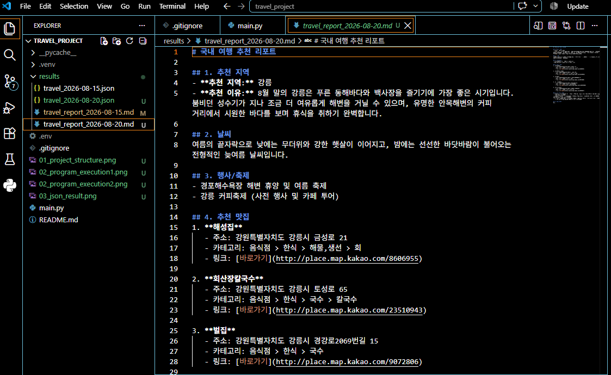
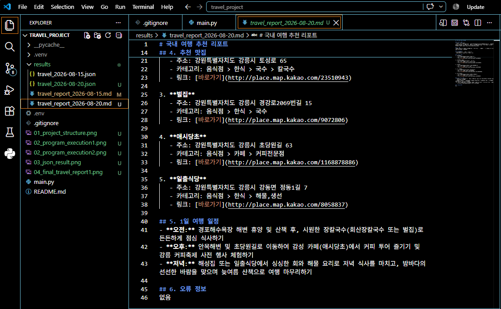
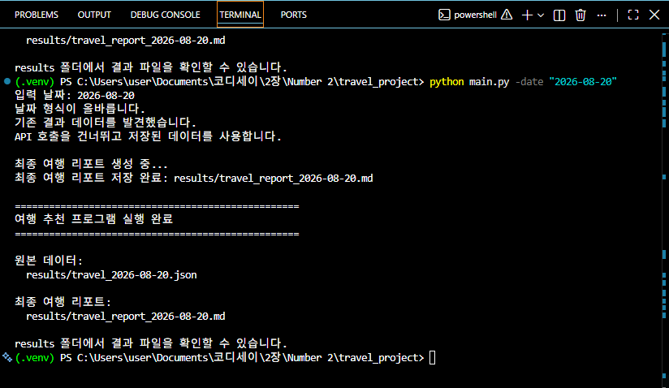

# AI 여행 추천 CLI 프로그램

여행 날짜를 입력하면 AI가 여행지를 추천해 주고,
추천된 지역의 맛집을 찾아서 하나의 여행 리포트로 만들어 주는
Python 프로그램입니다.

이 프로그램은 터미널에서 실행하는 **CLI(Command Line Interface) 프로그램**입니다.

사용자는 여행 날짜만 입력하면 됩니다.

예:

```text
python main.py -date "2026-08-20"
```
그러면 프로그램이 자동으로 다음 작업을 진행합니다.

여행 날짜 입력 → AI 여행지 추천 → 맛집 검색 → 여행 리포트 생성

---
## 1. 프로그램은 무엇을 하는가?

이 프로그램은 크게 3가지 일을 합니다.

① Gemini에게 여행지를 추천받습니다.

Google Gemini API를 사용하여 입력한 날짜에 어울리는 여행지를 추천받습니다.

예를 들어 다음과 같이 입력하면:

```text
2026-08-20
```
Gemini가 다음과 같은 정보를 만들어 줍니다.

- 추천 지역
- 날씨
- 행사 및 축제
- 여행지를 추천하는 이유

② Kakao에서 맛집을 검색합니다.

Gemini가 추천한 여행 지역을 Kakao Local API에 전달합니다.

예를 들어 Gemini가 강릉을 추천했다면,

```text
강릉
   ↓
Kakao Local API
   ↓
강릉 맛집 검색
   ↓
맛집 최대 5곳
```
과정을 통해 맛집 정보를 가져옵니다.

맛집 이름, 주소, 카테고리, URL 등의 정보를 얻습니다.

③ 여행 리포트를 만들어 저장합니다.

마지막으로 여행 추천 정보와 맛집 정보를 합쳐서
Markdown 형식의 여행 리포트를 만듭니다.

결과 파일은 results/ 폴더에 저장됩니다.

예:

```text
results/
├── travel_2026-08-20.json
└── travel_report_2026-08-20.md
```
---

## 2. 프로그램 전체 흐름

프로그램 전체 과정을 쉽게 표현하면 다음과 같습니다.

```text
사용자가 여행 날짜 입력
          ↓
     날짜 형식 확인
          ↓
기존 결과 파일이 있는지 확인
          ↓
    ┌─────┴─────┐
    ↓           ↓
있음            없음
    ↓           ↓
기존 데이터     Gemini API 호출
사용            ↓
    │       여행지 추천
    │           ↓
    │       추천 도시 확인
    │           ↓
    │       Kakao API 호출
    │           ↓
    │       맛집 검색
    │           ↓
    └─────┬─────┘
          ↓
     원본 JSON 저장
          ↓
    최종 여행 리포트 생성
          ↓
   Markdown 파일 저장
          ↓
     결과 위치 출력
```
---

## 3. 사용한 기술

이 프로젝트에서는 다음 기술을 사용했습니다.

| 기술              | 사용하는 이유                    |
| --------------- | -------------------------- |
| Python          | 프로그램을 만들기 위해 사용            |
| argparse        | 터미널에서 날짜를 입력받기 위해 사용       |
| Gemini API      | AI 여행지 추천을 받기 위해 사용        |
| Kakao Local API | 여행지의 맛집을 검색하기 위해 사용        |
| requests        | 인터넷으로 API를 요청하기 위해 사용      |
| python-dotenv   | API 키를 안전하게 관리하기 위해 사용     |
| JSON            | API에서 받은 데이터를 저장하기 위해 사용   |
| Markdown        | 최종 여행 리포트를 만들기 위해 사용       |
| Git / GitHub    | 프로젝트와 결과물을 저장하고 관리하기 위해 사용 |

---

## 4. 프로젝트 구조

```text
travel_project/
├── .venv/                  # Python 가상환경
├── results/                # 프로그램 실행 결과
├── .env                    # API 키 저장
├── .gitignore              # Git에 올리지 않을 파일 설정
├── main.py                 # 실제 프로그램 코드
└── README.md               # 프로젝트 설명서
```

각 파일의 역할을 간단히 설명하면 다음과 같습니다.

main.py

프로그램의 핵심 코드가 들어 있는 파일입니다.

날짜를 입력받고,
Gemini API와 Kakao API를 호출하고,
결과 파일을 저장하는 모든 작업을 담당합니다.

results/

프로그램을 실행한 결과가 저장되는 폴더입니다.

```text
travel_2026-08-20.json
travel_report_2026-08-20.md
```
와 같은 파일이 만들어집니다.

.env

Gemini와 Kakao API를 사용하기 위한 비밀 키를 저장합니다.

실제 API 키는 GitHub에 올리지 않습니다.

.gitignore

.env, .venv 등 GitHub에 올리지 않아야 하는 파일을 지정합니다.

---

## 5. API 키 설정

이 프로그램은 인터넷의 외부 서비스를 사용하기 때문에
API 키가 필요합니다.

API 키는 프로그램 코드에 직접 작성하지 않고 .env 파일에 저장합니다.

.env 파일은 다음과 같은 형태입니다.

```text
GEMINI_API_KEY=YOUR_GEMINI_API_KEY
KAKAO_REST_API_KEY=YOUR_KAKAO_REST_API_KEY
```

YOUR_GEMINI_API_KEY와 YOUR_KAKAO_REST_API_KEY 부분에
각 서비스에서 발급받은 실제 API 키를 입력합니다.

중요한 주의사항

실제 API 키는 다음 장소에 공개하면 안 됩니다.

- GitHub
- README.md
- Python 코드
- 다른 사람에게 공유하는 파일
- 인터넷에 공개되는 화면

API 키가 공개되면 다른 사람이 사용할 수 있기 때문에
보안에 주의해야 합니다.

---

## 6. API 키를 안전하게 관리하는 방법

API 키가 들어 있는 .env 파일은 GitHub에 올라가지 않도록 설정했습니다.

.gitignore에는 다음 내용이 있습니다.

```text
.env
.venv/
__pycache__/
```
따라서 .env 파일과 Python 가상환경은 GitHub에 업로드하지 않습니다.

---

## 7. 가상환경 실행

Python 프로젝트에서는 필요한 프로그램만 따로 관리하기 위해
가상환경을 사용할 수 있습니다.

Windows PowerShell에서 프로젝트 폴더로 이동한 후 다음 명령을 실행합니다.

```text
.venv\Scripts\Activate.ps1
```
정상적으로 실행되면 터미널 앞에 다음과 같이 표시됩니다.

```text
(.venv)
```
PowerShell에서 실행 정책 오류가 발생하는 경우 다음 명령을 사용할 수 있습니다.

```text
Set-ExecutionPolicy -ExecutionPolicy RemoteSigned -Scope CurrentUser
```

---

## 8. 필요한 패키지 설치

프로그램에서 사용하는 Python 패키지를 설치합니다.

```text
pip install requests python-dotenv
```

requests

인터넷으로 Gemini와 Kakao API에 요청을 보내기 위해 사용합니다.

python-dotenv

.env 파일에 저장된 API 키를 Python 프로그램에서 사용할 수 있도록 해줍니다.

---

## 9. 프로그램 실행 방법

다음 명령으로 프로그램을 실행합니다.

```text
python main.py -date "2026-08-20"
```
여기서 -date는 여행 날짜를 의미합니다.

날짜는 반드시 다음 형식으로 입력해야 합니다.

```text
YYYY-MM-DD
```
예:

```text
python main.py -date "2026-08-20"
```
잘못된 날짜 형식을 입력하면 프로그램이 오류 메시지를 보여주고 종료합니다.

---

## 10. 실제 프로그램 실행 과정

프로그램을 실행하면 다음과 같은 과정이 진행됩니다.

### 1단계. 날짜 확인

사용자가 입력한 날짜가 올바른 형식인지 확인합니다.

```text
입력 날짜: 2026-08-20
날짜 형식이 올바릅니다.
```

### 2단계. 여행지 추천

Gemini API를 호출하여 여행지를 추천받습니다.

```text
Gemini API 호출 중...
```
그 후 다음과 같은 정보가 출력됩니다.

```text
1차 여행 추천 결과:

추천 지역: 강릉
날씨: ...
행사:
- ...
- ...

추천 이유:
...
```

### 3단계. 맛집 검색

추천된 도시를 이용해서 Kakao Local API에 맛집을 검색합니다.

```text
Kakao 맛집 검색 중...
Kakao HTTP 상태 코드: 200
맛집 검색 결과: 5곳
```
검색된 맛집에는 다음 정보가 포함됩니다.

- 맛집 이름
- 주소
- 카테고리
- URL
- 위치 좌표

### 4단계. 원본 데이터 저장

API에서 받은 데이터를 JSON 파일로 저장합니다.

```text
원본 데이터 저장 완료:
results/travel_2026-08-20.json
```

### 5단계. 최종 여행 리포트 생성

추천 여행지와 맛집 정보를 이용하여
최종 여행 리포트를 생성합니다.

```text
최종 여행 리포트 생성 중...
최종 여행 리포트 저장 완료:
results/travel_report_2026-08-20.md
```

### 6단계. 결과 위치 안내

프로그램이 마지막에 결과 파일의 위치를 알려줍니다.

```text
==================================================
여행 추천 프로그램 실행 완료
==================================================

원본 데이터:
results/travel_2026-08-20.json

최종 여행 리포트:
results/travel_report_2026-08-20.md
```

---

## 11. 프로그램 실행 화면

실제 프로그램을 실행한 화면입니다.





---

## 12. 원본 JSON 결과

프로그램은 API에서 받은 정보를 JSON 파일로 저장합니다.

JSON은 데이터를 일정한 형식으로 정리해서 저장하는 방법입니다.

예를 들어 다음과 같은 정보가 저장됩니다.

- 여행 날짜
- 추천 지역
- 날씨
- 행사
- 추천 이유
- 맛집 정보
- 오류 정보

실제 생성된 JSON 결과를 확인할 수 있습니다.



---

## 13. 최종 여행 리포트

프로그램은 마지막에 Markdown 형식의 여행 리포트를 만듭니다.

리포트에는 다음과 같은 내용이 포함됩니다.

추천 지역
여행 추천 이유
날씨
행사 및 축제
추천 맛집
여행 일정

실제 생성된 여행 리포트 화면입니다.





---

## 14. 결과 파일

실행이 완료되면 results/ 폴더에 결과가 저장됩니다.

```text
results/
├── travel_2026-08-20.json
└── travel_report_2026-08-20.md
```

### JSON 파일

```text
travel_2026-08-20.json
```
Gemini와 Kakao API에서 받은 원본 정보를 저장합니다.

### Markdown 파일

```text
travel_report_2026-08-20.md
```
사용자가 읽기 편하도록 정리한 최종 여행 리포트입니다.

---

## 15. 오류 처리

이 프로그램은 인터넷을 사용하는 프로그램이기 때문에
API를 사용하는 과정에서 여러 가지 오류가 발생할 수 있습니다.

프로그램에서는 이러한 상황에 대비하여 오류 처리를 구현했습니다.

### Gemini API 오류

Gemini API 호출에 문제가 발생하면 오류 내용을 확인하고 처리합니다.

### SON 파싱 오류

Gemini가 JSON 형식으로 답변하지 않는 경우를 대비하여
JSON 형식으로 다시 요청하는 재시도 기능을 구현했습니다.

재시도는 최대 1회 진행합니다.

### Kakao API 오류

Kakao 맛집 검색에 문제가 발생하더라도
프로그램 전체가 바로 종료되지 않도록 처리했습니다.

맛집 정보를 가져오지 못한 경우에도
최종 여행 리포트를 생성할 수 있도록 구성했습니다.

### API 키 오류

필요한 API 키가 설정되어 있지 않으면
사용자에게 API 키를 설정해야 한다는 안내를 보여줍니다.

---

## 16. 보너스 과제 - 결과 캐싱

이 프로그램에는 결과 캐싱 기능을 추가했습니다.

캐싱은 쉽게 말하면

"이미 한 번 만들어 놓은 결과를 다시 사용하는 것"

입니다.

예를 들어 2026-08-20 날짜로 프로그램을 한 번 실행하면:

```text
results/travel_2026-08-20.json
```
파일이 만들어집니다.

이후 같은 날짜로 다시 실행하면
처음부터 Gemini와 Kakao API를 다시 호출하지 않습니다.

대신 기존에 저장된 결과를 사용합니다.

```text
입력 날짜: 2026-08-20
날짜 형식이 올바릅니다.
기존 결과 데이터를 발견했습니다.
API 호출을 건너뛰고 저장된 데이터를 사용합니다.
```
즉,

```text
첫 번째 실행

날짜 입력
   ↓
Gemini API
   ↓
Kakao API
   ↓
결과 저장
```
두 번째 실행부터는:

```text
같은 날짜 입력
   ↓
기존 결과 확인
   ↓
기존 결과 사용
   ↓
API 호출 생략
```
이렇게 동작합니다.

### 캐싱 기능을 사용하는 이유

같은 날짜의 결과를 다시 요청하지 않아도 되기 때문에

- 불필요한 API 호출을 줄일 수 있습니다.
- API 사용량을 줄일 수 있습니다.
- 실행 시간을 줄일 수 있습니다.
- 기존 결과를 다시 사용할 수 있습니다.

### 캐싱 실행 화면

실제로 같은 날짜를 다시 실행하여
기존 결과를 사용하는 것을 확인했습니다.



---

## 17. GitHub와 결과물 관리

이 프로젝트는 Git을 이용하여 프로그램의 변경 내용을 관리하고
GitHub 저장소에 업로드했습니다.

GitHub 저장소에는 다음과 같은 프로젝트 파일과 결과물이 포함되어 있습니다.

- main.py
- README.md
- .gitignore
- results/
- 실행 결과 캡처 이미지

단, API 키가 들어 있는 .env 파일은 GitHub에 업로드하지 않았습니다.

---

## 18. 학습 목표

이 프로젝트를 만들면서 다음 내용을 학습했습니다.

### Python
- Python CLI 프로그램 만들기
- 함수 작성 및 활용
- 조건문과 반복문
- 예외 처리
- JSON 파일 저장

### API
- REST API의 기본 개념
- HTTP GET / POST 방식
- API 요청과 응답 확인
- API 키를 이용한 인증
- 서로 다른 API를 연결해서 사용하는 방법

### Gemini
- AI API를 프로그램에서 호출하는 방법
- AI에게 JSON 형식의 결과를 요청하는 방법
- AI의 결과를 Python 데이터로 변환하는 방법

### Kakao Local API
- 추천된 도시를 API의 검색어로 사용하는 방법
- 검색 결과에서 필요한 정보를 가져오는 방법

### 파일 관리
- JSON 파일 저장
- Markdown 파일 생성
- 실행 결과를 results/ 폴더에 관리하는 방법

### 보안
- .env를 이용한 API 키 관리
- .gitignore를 이용하여 비밀 정보가 GitHub에 올라가지 않도록 하는 방법

### 최적화
- 기존 결과를 다시 사용하는 캐싱 기능
- 불필요한 API 호출을 줄이는 방법

### Git / GitHub
- Git 저장소 생성
- commit
- push
- GitHub를 이용한 프로젝트 관리

---

## 19. 마무리

이 프로젝트는 사용자가 여행 날짜만 입력하면

```text
여행 날짜
   ↓
AI 여행지 추천
   ↓
맛집 검색
   ↓
데이터 저장
   ↓
최종 여행 리포트
```
까지 자동으로 처리하는 프로그램입니다.

또한 기존 결과를 재사용하는 캐싱 기능을 추가하여
같은 날짜에 대한 불필요한 API 호출을 줄일 수 있도록 개선했습니다.

이 프로젝트를 통해 Python 프로그램에서 외부 API를 사용하고,
API 결과를 가공하여 새로운 결과물로 만드는 전체 과정을 경험했습니다.
